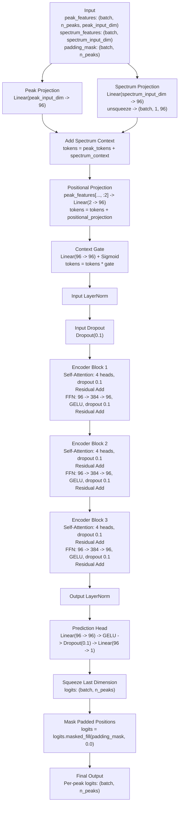

```mermaid
flowchart TD
    A["Input<br/>peak_features: (batch, n_peaks, peak_input_dim)<br/>spectrum_features: (batch, spectrum_input_dim)<br/>padding_mask: (batch, n_peaks)"]
    B["Peak Projection<br/>Linear(peak_input_dim -> 96)"]
    C["Spectrum Projection<br/>Linear(spectrum_input_dim -> 96)<br/>unsqueeze -> (batch, 1, 96)"]
    D["Add Spectrum Context<br/>tokens = peak_tokens + spectrum_context"]
    E["Positional Projection<br/>peak_features[..., :2] -> Linear(2 -> 96)<br/>tokens = tokens + positional_projection"]
    F["Context Gate<br/>Linear(96 -> 96) + Sigmoid<br/>tokens = tokens * gate"]
    G["Input LayerNorm"]
    H["Input Dropout<br/>Dropout(0.1)"]
    I["Encoder Block 1<br/>Self-Attention: 4 heads, dropout 0.1<br/>Residual Add<br/>FFN: 96 -> 384 -> 96, GELU, dropout 0.1<br/>Residual Add"]
    J["Encoder Block 2<br/>Self-Attention: 4 heads, dropout 0.1<br/>Residual Add<br/>FFN: 96 -> 384 -> 96, GELU, dropout 0.1<br/>Residual Add"]
    K["Encoder Block 3<br/>Self-Attention: 4 heads, dropout 0.1<br/>Residual Add<br/>FFN: 96 -> 384 -> 96, GELU, dropout 0.1<br/>Residual Add"]
    L["Output LayerNorm"]
    M["Prediction Head<br/>Linear(96 -> 96) -> GELU -> Dropout(0.1) -> Linear(96 -> 1)"]
    N["Squeeze Last Dimension<br/>logits: (batch, n_peaks)"]
    O["Mask Padded Positions<br/>logits = logits.masked_fill(padding_mask, 0.0)"]
    P["Final Output<br/>Per-peak logits: (batch, n_peaks)"]

    A --> B
    A --> C
    B --> D
    C --> D
    D --> E
    E --> F
    F --> G
    G --> H
    H --> I
    I --> J
    J --> K
    K --> L
    L --> M
    M --> N
    N --> O
    O --> P
```
